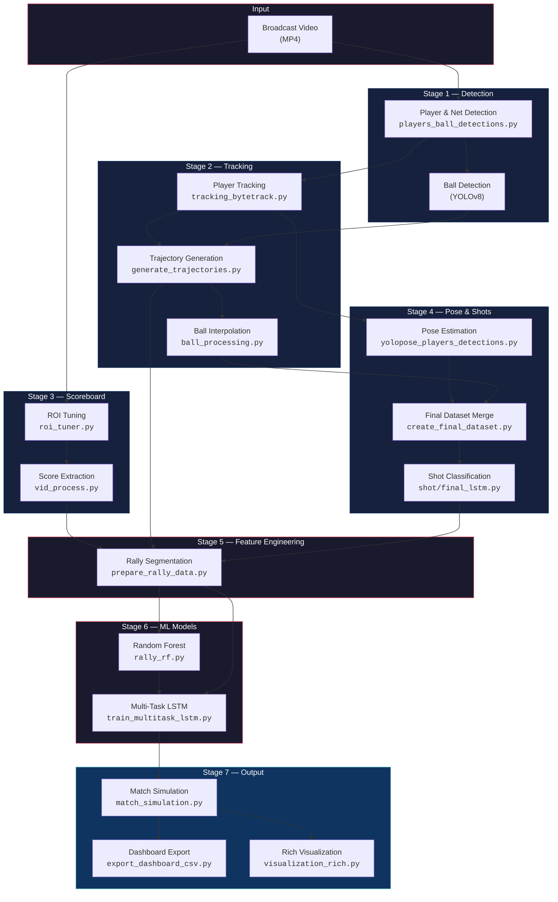
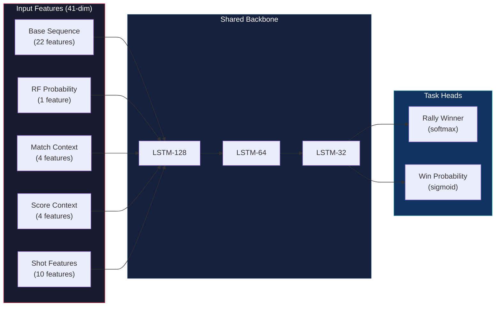

<h1 align="center">Tennis Game Analysis</h1>

<p align="center">
  <strong>An end-to-end deep learning pipeline that transforms raw broadcast tennis footage into frame-accurate rally predictions, live win-probability curves, and an interactive analytics dashboard.</strong>
</p>

<p align="center">
  
  
  
  
  
</p>

---

## 📋 Table of Contents

- [Overview](#-overview)
- [Pipeline Architecture](#-pipeline-architecture)
- [Key Features](#-key-features)
- [Project Structure](#-project-structure)
- [Pipeline Stages](#-pipeline-stages)
  - [Stage 1 — Video Ingestion & Object Detection](#stage-1--video-ingestion--object-detection)
  - [Stage 2 — Tracking & Trajectory Generation](#stage-2--tracking--trajectory-generation)
  - [Stage 3 — Scoreboard OCR & Score Extraction](#stage-3--scoreboard-ocr--score-extraction)
  - [Stage 4 — Pose Estimation & Shot Classification](#stage-4--pose-estimation--shot-classification)
  - [Stage 5 — Rally Data Preparation & Feature Engineering](#stage-5--rally-data-preparation--feature-engineering)
  - [Stage 6 — ML Modelling](#stage-6--ml-modelling)
  - [Stage 7 — Match Simulation & Dashboard Export](#stage-7--match-simulation--dashboard-export)
- [Models & Techniques](#-models--techniques)
- [Installation & Setup](#-installation--setup)
- [Usage](#-usage)
- [Results](#-results)
- [Tech Stack](#-tech-stack)

---

## Overview

**Tennis Game Analysis** is a comprehensive computer vision and machine learning system designed to analyze professional tennis matches from broadcast video. The pipeline autonomously:

1. **Detects** players, the ball, and the net using fine-tuned YOLOv8 models.
2. **Tracks** player movements across frames and generates smooth trajectories.
3. **Reads** the on-screen scoreboard via EasyOCR with temporal validation.
4. **Classifies** shot types (Serve, Forehand, Backhand, Volley, Smash) using a Bidirectional LSTM trained on pose keypoints.
5. **Segments** the match into individual rallies and engineers 25+ kinematic features per rally.
6. **Predicts** rally winners using a Random Forest ensemble and a Multi-Task LSTM that jointly learns rally outcomes and live win probability.
7. **Simulates** the full match point-by-point, producing frame-synchronized data ready for dashboard visualization.

The system has been validated on multiple Wimbledon broadcast recordings (V007, V008, V010).

---

## Pipeline Architecture



---

## Key Features

| Capability | Description |
|:---|:---|
| **Custom YOLOv8 Detection** | Fine-tuned models for player, net, and ball detection with court-boundary filtering and net-based player ID assignment |
| **Temporal Score Validation** | EasyOCR scoreboard reading with HSV-based change detection, 12-frame stability gating, and valid transition enforcement |
| **Pose-Driven Shot Classification** | YOLOv8-Pose extracts 17-keypoint skeletons; a Bidirectional LSTM + GRU classifies 6 shot types (Forehand, Backhand, Serve, Volley, Smash, None) |
| **22-Feature Rally Sequences** | Per-frame sequences encoding player positions, velocities, accelerations, shot one-hots, and score context — zero-padded to 150 frames |
| **Multi-Task LSTM** | Shared LSTM backbone (128→64→32) with two heads: rally winner classification and continuous win probability regression |
| **Data Augmentation** | Player-mirroring during LSTM training; Gaussian noise + time-shift + scale augmentation for rare shot classes |
| **End-to-End Simulation** | Full match replay with point-by-point predictions, game/set boundary detection, and frame-accurate dashboard CSVs |

---

## Project Structure

```
Tennis-Game-Analysis/
│
├── Detection & Tracking
│   ├── players_ball_detections.py    # YOLOv8 player/net/ball detection + gameplay filtering
│   ├── tracking_bytetrack.py         # Gameplay frame extraction & player tracking
│   ├── generate_trajectories.py      # Combined player + ball trajectory CSV
│   └── ball_processing.py            # Ball interpolation, smoothing & velocity computation
│
├── Scoreboard Processing
│   ├── roi_tuner.py                  # Interactive ROI selector for scoreboard digit regions
│   └── vid_process.py                # EasyOCR score extraction with temporal validation
│
├── Pose & Shot Classification
│   ├── yolopose_players_detections.py  # YOLOv8-Pose keypoint extraction per player crop
│   ├── create_final_dataset.py         # Merges tracking + ball + pose into unified dataset
│   └── shot/
│       ├── mapping_shots.py            # Label mapping pipeline (Colab)
│       ├── final_lstm.py               # BiLSTM+GRU shot classifier training (Colab)
│       ├── final_finding_moments.py    # Shot moment detection
│       └── predicting_final.py         # Shot prediction inference
│
├── Feature Engineering & ML
│   ├── prepare_rally_data.py         # Rally segmentation, winner labelling, 22-feature extraction
│   ├── rally_rf.py                   # Random Forest + GridSearchCV rally prediction
│   └── train_multitask_lstm.py       # Multi-task LSTM (rally winner + win probability)
│
├── Simulation & Visualization
│   ├── match_simulation.py           # Point-by-point match replay with predictions
│   ├── export_dashboard_csv.py       # Frame-synchronized dashboard CSV generation
│   ├── visualization_rich.py         # Annotated video with trails, shots & timeline
│   └── visualization_simple.py       # Lightweight annotated video output
│
├── models/                           # Trained model weights & metadata (git-ignored)
├── input/                            # Source video files (git-ignored)
├── .gitignore
└── README.md
```

---

## Pipeline Stages

### Stage 1 — Video Ingestion & Object Detection

**Script:** `players_ball_detections.py`

- Loads two **fine-tuned YOLOv8** models: one for **player + net** detection, another for **ball** detection.
- Applies court-boundary margins and minimum bounding-box height filtering to reject ball boys, umpires, and crowd figures.
- Uses **smoothed net Y-coordinate** (rolling average over 10 frames) as the dividing line to assign **Player 1** (below net) and **Player 2** (above net).
- The **gameplay gate** enforces that both players are visible on opposite sides of the net with minimum size — filtering replays, crowd shots, and between-point intervals.
- Ball detection runs **only on confirmed gameplay frames**, saving compute.

### Stage 2 — Tracking & Trajectory Generation

**Scripts:** `tracking_bytetrack.py` → `generate_trajectories.py` → `ball_processing.py`

- **ByteTrack extraction** filters the raw detection CSV to gameplay-only frames and outputs per-player bounding box tracks.
- **Trajectory generation** merges player center coordinates with ball positions into a unified CSV.
- **Ball processing** performs gap-aware linear interpolation (capped at 15 frames to avoid bridging across rallies), temporal smoothing (±3 frame window), and per-frame velocity computation.

### Stage 3 — Scoreboard OCR & Score Extraction

**Scripts:** `roi_tuner.py` → `vid_process.py`

- **ROI Tuner** provides an interactive OpenCV GUI with trackbar sliders to visually select and lock the pixel coordinates of each scoreboard digit region (points, games, sets for both players).
- **Score Extraction** uses **EasyOCR** with per-ROI change detection:
  - HSV blue-ratio check determines scoreboard visibility state (`SHRUNK`, `EXPANDED`, `NONE`).
  - 12-frame temporal smoothing prevents flicker-based state switches.
  - OCR runs only when pixel diff exceeds threshold, minimizing redundant inference.
  - Predictions are validated against legal tennis score transitions (e.g., `0→15→30→40→AD`).
  - Game-end logic auto-resets point scores to `0-0` and infers game winners from score context.

### Stage 4 — Pose Estimation & Shot Classification

**Scripts:** `yolopose_players_detections.py` → `create_final_dataset.py` → `shot/final_lstm.py`

- **Pose Estimation** crops each tracked player with 15% bbox expansion, resizes to 640×640 with padding, and runs **YOLOv8n-Pose** to extract 17 COCO keypoints with confidence scores.
- **Final Dataset** merges bounding boxes, ball trajectories (with velocity), and pose keypoints into a single per-frame, per-player CSV.
- **Shot Classification** (trained in Google Colab):
  - Uses 15 engineered features (wrist velocity, arm angle, ball velocity, wrist-ball distance, contact detection, etc.).
  - Windowed sequences (length 20) with 70% purity threshold for label assignment.
  - **Bidirectional LSTM (128) → BiLSTM (64) → GRU (32)** architecture with BatchNorm and Dropout.
  - Heavy augmentation for rare classes (Smash, Volley): 15× Gaussian noise + time-shift + scale variation.
  - Class-balanced training with computed sample weights.

### Stage 5 — Rally Data Preparation & Feature Engineering

**Script:** `prepare_rally_data.py`

Rally segmentation and feature engineering is the core bridge between raw tracking data and ML models:

- **Rally Segmentation:** Detects score changes in the OCR output to segment the match into individual rallies.
- **Winner Labelling:** Infers rally winners through a priority cascade:
  1. Normal point increment (`15→30`)
  2. Game counter change in OCR (`games +1`)
  3. Score reset to `0-0` with advantage inference
  4. Advantage/Deuce transitions
  5. Set counter fallback

- **Per-Rally Features (25+):**

  | Category | Features |
  |:---|:---|
  | **Kinematics** | Distance, avg/max speed, acceleration, late speed diff |
  | **Court** | Net proximity, court coverage, late spread |
  | **Ball** | Average ball speed, speed momentum (late − early) |
  | **Match** | Score encoding, server identification |
  | **Shots** | Shot count, shot-type one-hot vectors |

- **Sequences:** 22-dimensional per-frame vectors (positions, velocities, accelerations, shot one-hot, score) zero-padded to 150 timesteps and saved as `.npz`.

### Stage 6 — ML Modelling

#### Random Forest — `rally_rf.py`

- Pipeline: `StandardScaler → SelectKBest (f_classif) → RandomForestClassifier`
- Hyperparameter search via **GridSearchCV** (k=[10,15,18,all], n_estimators=[50,100,200], max_depth=[3,5,7])
- Generates **Out-of-Fold (OOF)** probability predictions used as an input feature for the LSTM.

#### Multi-Task LSTM — `train_multitask_lstm.py`



- **Architecture:** 3-layer stacked LSTM (128→64→32) with 30% dropout, branching into two task heads:
  - **Rally Winner** — 2-class softmax (categorical cross-entropy)
  - **Win Probability** — sigmoid output (binary cross-entropy), trained on a logistic advantage score
- **Training Strategy:**
  - 5-fold Stratified Cross-Validation
  - Player-mirroring augmentation (swaps P1↔P2 features and inverts labels) for 2× training data
  - Early stopping (patience=15) + ReduceLROnPlateau (factor=0.5, patience=7)
  - Joint loss: `1.0 × rally_loss + 0.3 × win_prob_loss`

### Stage 7 — Match Simulation & Dashboard Export

**Scripts:** `match_simulation.py` → `export_dashboard_csv.py`

- **Match Simulation** replays the match point-by-point using OOF predictions:
  - Detects game boundaries from OCR score resets (`0-0`)
  - Tracks simulated games/sets with standard tennis rules (first to 6 games with 2-game lead, tiebreak at 6-6)
  - Computes point-level, game-level, and match-level prediction accuracy
  - Outputs a full trajectory of P1 win probability across the match

- **Dashboard Export** merges simulation results with frame boundaries and server info into a single CSV with columns: `rally_id`, `start_frame`, `end_frame`, `server`, `actual_winner`, `predicted_winner`, `correct`, `score`, `p1_win_probability`, `p2_win_probability`.

---

## Models & Techniques

| Component | Model / Algorithm | Key Details |
|:---|:---|:---|
| Player & Net Detection | YOLOv8 (fine-tuned) | Custom-trained on tennis court data; net-Y smoothing for stable player assignment |
| Ball Detection | YOLOv8 (fine-tuned) | Runs only on gameplay frames; gap-aware interpolation post-processing |
| Pose Estimation | YOLOv8n-Pose | 17 COCO keypoints per player; confidence-thresholded at 0.4 |
| Scoreboard Reading | EasyOCR | HSV change detection, 12-frame state smoothing, legal transition validation |
| Shot Classification | BiLSTM + GRU | 6-class (Forehand, Backhand, Serve, Volley, Smash, None); heavy augmentation for rare classes |
| Rally Prediction (RF) | Random Forest + GridSearch | StandardScaler → SelectKBest → RF; Out-of-Fold predictions fed to LSTM |
| Rally + Win Prob (LSTM) | Multi-Task LSTM | 128→64→32 shared backbone; dual-head (rally winner + win probability) |
| Match Simulation | Rule-based Engine | Tennis scoring rules; game/set boundary detection from OCR |

---

## Installation & Setup

### Prerequisites

- Python 3.10+
- CUDA-capable GPU recommended (for YOLOv8 inference and LSTM training)

### 1. Clone the Repository

```bash
git clone https://github.com/DARKRAI1234/Tennis-Game-Analysis.git
cd Tennis-Game-Analysis
```

### 2. Create a Virtual Environment

```bash
python -m venv venv
source venv/bin/activate      # Linux/macOS
venv\Scripts\activate         # Windows
```

### 3. Install Dependencies

```bash
pip install opencv-python numpy pandas tensorflow ultralytics easyocr
pip install scikit-learn xgboost imbalanced-learn joblib
```

### 4. Prepare Models

Place your fine-tuned YOLOv8 weights in the `runs/detect/` directory:
- `runs/detect/train9/weights/best.pt` — Player & Net model
- `runs/detect/train5/weights/best.pt` — Ball model

Download or ensure `yolov8n-pose.pt` is accessible for pose estimation.

### 5. Prepare Input Video

Place your broadcast tennis video (MP4) in the `input/` directory.

---

## Usage

Run the pipeline stages **sequentially**:

```bash
# Stage 1 & 2 — Detection & Tracking
python players_ball_detections.py
python tracking_bytetrack.py
python generate_trajectories.py
python ball_processing.py

# Stage 3 — Scoreboard OCR
python roi_tuner.py --video input/V010.mp4       # Tune ROI coordinates (one-time)
python vid_process.py --video input/V010.mp4      # Extract scores

# Stage 4 — Pose & Shot Features
python yolopose_players_detections.py
python create_final_dataset.py
# Shot classification is trained in Google Colab (see shot/final_lstm.py)

# Stage 5 — Rally Feature Engineering
python prepare_rally_data.py v010

# Stage 6 — Model Training
python rally_rf.py v010
python train_multitask_lstm.py --match v010

# Stage 7 — Simulation & Export
python match_simulation.py v010
python export_dashboard_csv.py v010

# (Optional) — Visualization
python visualization_rich.py
```

---

## Results

The pipeline has been validated across **three Wimbledon match recordings** (v007, v008, v010):

| Metric | Description |
|:---|:---|
| **Rally Prediction Accuracy** | Stratified 5-fold cross-validated accuracy of the Multi-Task LSTM |
| **Win Probability MAE** | Mean Absolute Error of continuous win probability predictions |
| **Game-Level Accuracy** | Percentage of games where the predicted majority rally winner matches the actual game winner |
| **Match Winner** | Correct identification of the overall match winner |

The Multi-Task LSTM consistently outperforms the standalone Random Forest by leveraging temporal sequence information from player trajectories, incorporating RF out-of-fold probabilities as a feature, and jointly learning match-level win probability alongside per-rally predictions.

---

## Tech Stack

<table>
  <tr>
    <td align="center" width="140"><strong>Category</strong></td>
    <td><strong>Technologies</strong></td>
  </tr>
  <tr>
    <td align="center">Computer Vision</td>
    <td>OpenCV, YOLOv8 (Ultralytics), EasyOCR, YOLOv8-Pose</td>
  </tr>
  <tr>
    <td align="center">Deep Learning</td>
    <td>TensorFlow / Keras (LSTM, GRU, BiLSTM, Multi-Task Learning)</td>
  </tr>
  <tr>
    <td align="center">Classical ML</td>
    <td>scikit-learn (Random Forest, GridSearchCV, StratifiedKFold), XGBoost</td>
  </tr>
  <tr>
    <td align="center">Data Processing</td>
    <td>Pandas, NumPy</td>
  </tr>
  <tr>
    <td align="center">Visualization</td>
    <td>OpenCV (annotated video), Matplotlib, Seaborn</td>
  </tr>
  <tr>
    <td align="center">Training Infra</td>
    <td>Google Colab (GPU), Local CUDA for inference</td>
  </tr>
</table>

---
